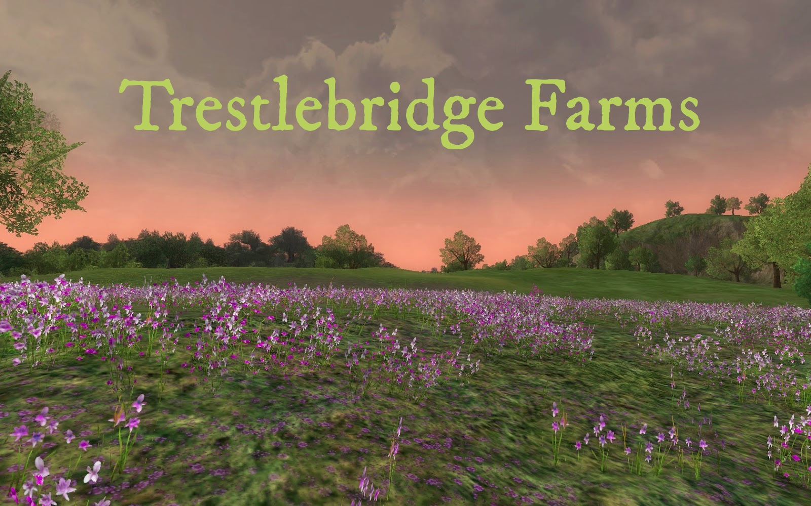

# Before You Start

You are inheriting a code base. You cannot start from scratch and build your own, because you will almost never get that opportunity on the job. You must read the current code with your teammates and try to understand what it is doing. Then you must refactor it - even if it means deleting some of the code that currently exists - to build the rest of the features.

The goal of this group project, likely more than any other one, is to *learn*. Focusing on productivity is something you will need to worry about on the job. Have fun with this code, make lots of mistakes, refactor them, and learn about what you can do with C#.

This will be a large challenge. How will you respond to it? Attack it with excitement, or withdraw from it in defeat? Time to see how far you have come with working on your Growth Mindset.

## Guidelines

* You will not learn anything in this group project if you don't communicate well with each other.
* You will not get anything done if you don't communicate well with each other.
* Collaboration is key in this project. Working solo will get you nowhere.
* Showing up late, extended lunches, going home early and leaving your team stranded will get you pulled off the team.
* Create [pull request and issue ticket templates](https://help.github.com/en/articles/about-issue-and-pull-request-templates) for your team.

# Trestlebridge Farms

You and your friends have decided to connect with the earth again and abandon your reliance on technology and urban vices. You have built a business plan, presented it to a bank, and have secured $5 million to purchase an abandoned farm and produce high quality, responsibly grown and raised meat, seed, eggs, feathers and compost.

You have met with other growers and ranchers in the Middle Tennessee area and have decided on the animals and plants below to build your farm. For each resource, you will find where it will be stored on the farm, what is produces when processed, and how much it produces.

## Livestock

| | Cows  | Pigs  | Chickens  | Ducks | Goats | Ostriches | Sheep |
|---|---|---|---|---|---|--|--|
| **Location** |  Grazing Fields | Grazing Fields | Chicken House | Duck House | Grazing Fields | Grazing Fields | Grazing Fields |
| **Feed per day** | 5.4kg | 3.2kg | 0.9kg | 0.8 kg | 4.1kg | 2.3kg | 4kg |
| **Product** | Meat | Meat | Egg / Feather / Meat | Egg / Feather | Compost | Egg / Meat | Meat |
| **Amount** | 18.25kg | 8.4kg | 7 / .5kg / 1.7kg | 6 / .75kg |  7.5kg | 3 / 2.6kg | 5kg |


## Seed

When you purchase seeds, you purchase enough for an entire row of plants in a field.

| | Sunflower | Wildflower | Sesame |
|---|---|---|---|
|**Location**| Plowed or Natural Field | Natural Field  | Plowed Field |
|**Product**| Seed / Compost | Compost | Seed |
|**Amount**| 650 / 21.6kg | 30.3kg | 520 |

## Storage Facilities

Listed below are the capacities of each storage facility.

| Plowed Field | Natural Field | Grazing Field | Chicken House | Duck House |
|---|---|---|---|---|
| 13 rows of plants <br/> 5 plants per row | 10 rows of plants <br/> 6 plants per row | 20 grazers | 15 | 12 |


## Processing Equipment

Listed below is how many animals/plants can be processed by each kind of equipment at one time.

| Meat Processor | Seed Harvester | Composter | Feather Harvester | Egg Gatherer |
|---|---|---|---|---|
| 7 animals | 5 rows of plants | 8 rows of plants | 8 birds | 15 eggs |

## Farm Animals and Raw Materials System (FARMS)

> _"We don't need no stinkin' JavaScript!"_
>  -- Jayden Michaels (a.k.a. RetroMan)

Fancy web applications are so 2017. Command line applications provide a much more hands-on, personal, bespoke, artisinal experience when managing a farm such as Trestlebridge. Therefore, even though you are casting off your digital personas to lead a life connected with the land, you still want to use your hard-earned skills as developers to make management of your farm as efficient as possible.

Here are the main features that the application must be able to perform.

### Main Menu

When the user first executes FARMS, they should be welcomed to the system and be presented with the following menu.

```sh
 +-++-++-++-++-++-++-++-++-++-++-++-++-+
 |T||r||e||s||t||l||e||b||r||i||d||g||e|
 +-++-++-++-++-++-++-++-++-++-++-++-++-+
           |F||a||r||m||s|
           +-++-++-++-++-+

1. Create Facility
2. Purchase Animals
3. Purchase Seeds
4. Processing Options (this is a stretch goal)

Choose a FARMS option.
> _
```

### Facility Creation Options Sub-Menu

If the user chooses option 1, then the following menu should be displayed

```sh
1. Grazing field
2. Plowed field
3. Natural field
4. Chicken house
5. Duck house

Choose what you want to create.
> _
```

When the user makes a choice, a new instance of that type of facility should be added to a `List<>` on your farm.

### Animal Purchase Menu

If the user chooses 2 from the main menu, then she should see the following menu, with the animals listed in alphabetical order.

```sh
1. Chicken
2. Cow
3. Duck
4. Goat
5. Ostrich
6. Pig
7. Sheep

Choose animals to purchase.
> _
```

When the user enters in what to buy, then display all of the locations in which the animals can be stored. The current number of animals should be displayed for each location.

```sh
1. Grazing Field (16 animals)
2. Grazing Field (4 animals)

Where would you like to place the animals?
> _
```

If the user chose to place them in a location that would be over capacity if they were placed there, display a message and show the menu again.

```sh
**** That facililty is not large enough ****
****     Please choose another one      ****

1. Grazing Field (16 animals)
2. Grazing Field (4 animals)

Where would you like to place the animals?
> _
```

### Seed Purchase Menu

If the user chooses 3 from the main menu, then she should see the following menu, with the plants listed in alphabetical order. You purchase enough seeds for an entire row at a time.

```sh
1. Sesame
2. Sunflower
3. Wildflower

Choose seed to purchase.
> _
```

When the user makes a choice, then display all of the locations in which the plants can be planted. The current number of plant rows should be displayed for each location.

```sh
1. Plowed Field (8 rows of plants)
2. Plowed Field (5 rows of plants)
3. Natural Field (0 rows of plants)

Where would you like to plant the Sunflowers?
> _
```

If the user chose to place them in a location that would be over capacity if they were placed there, display a message and show the menu again.

```sh
**** That facililty is not large enough ****
****     Please choose another one      ****

1. Plowed Field (8 rows of plants)
2. Plowed Field (5 rows of plants)
3. Natural Field (0 rows of plants)

Where would you like to plant the Sunflowers?
> _
```

## Stretch Goals

1. Display groups of things in each facility
    ```sh
    1. Grazing Field (12 pig, 5 cow, 1 sheep)

    or

    1. Natural Field (65 sunflower, 30 wildflower)
    2. Plowed Field (60 sesame, 20 sunflower)
    ```
2. Only show facilities that are able to store the number of animals/plants. For example, the user chooses to buy Wildflower seeds and one of the fields is already at capacity.
    ```sh
    1. Plowed Field (5 rows of plants)
    2. Plowed Field (13 rows of plants)  <-- not a valid choice
    3. Natural Field (0 plants)
    ```

     Instead of showing all possible options, only show valid options.

    ```sh
    1. Plowed Field (5 rows of plants)
    3. Natural Field (0 rows of plants)
    ```

### Processing Animals and Plants

👇🏽👇🏽👇🏽👇🏽👇🏽👇🏽👇🏽👇🏽👇🏽👇🏽👇🏽👇🏽👇🏽

**This is a stretch goal. Please make sure that you have menu options 1, 2, and 3 working before you take on menu option 4.**

☝🏻☝🏻☝🏻☝🏻☝🏻☝🏻☝🏻☝🏻☝🏻☝🏻☝🏻☝🏻☝🏻

### Processing Options

If the user choose 4 from the main menu, she should see the following options.

```sh
1. Seed Harvester
2. Meat Processor
3. Egg Gatherer
4. Composter
5. Feather Harvester

Choose equipment to use.
> _
```

When the user selects a piece of equipment, then present her with the current facilities that contain plants or animals that can be processed by that equipment.

For example, if she chose Meat Processor, the following should be presented.

```sh
1. Grazing Field (20 animals)
2. Chicken House (13 animals)
3. Duck House (7 animals)

Which facility has the animals you want to process?
> _
```

Once the storage facility is chosen, then list the type of things in that facility.

```sh
The following animals are in the Grazing Field.

1. 2 Ostrich
2. 13 Cow
3. 4 Pig
4. 11 Goat
5. 7 Sheep

Which resource should be processed?
> _
```

Lastly, when the type is chosen, ask the user how many.

```sh
How many Sheep should be processed?
> _
```

1. Verify that the equipment has the capacity to handle that many resources.
1. If it can query the user if they are done, or want to add more animals.

```sh
Ready to process? (Y/n)
> _
```

1. If user is done, remove _n_ of that type from the storage facility, and add _n_ to the equipment resource list.
2. Output what the result of processing it. For example, if user chose to process 30 sunflowers and 15 sesame plants, the following output should appear.
    ```sh
    4500 Sunflower seeds were produced
    600 Sesame seeds were produced
    ```
1. If the user is **not** done, take the user back to the menu showing storage facility options again.
    ```sh
    1. Grazing Field (20 animals)
    2. Chicken House (13 animals)
    3. Duck House (7 animals)

    Which facility has the animals you want to process?
    > _
    ```


### Class Definition Notes

Each resource class should have a overloaded `Process()` methods for each kind of product that it can produce. For example, here's a sample `Chicken` class.

Ref: [System.Guid.NewGuid()](https://docs.microsoft.com/en-us/dotnet/api/system.guid.newguid?redirectedfrom=MSDN&view=netframework-4.7.2#System_Guid_NewGuid)

```cs
public class Chicken
{
    // Fields
    private Guid _id;


    // Properties


    // Constructor
    public Chicken ()
    {
        _id = Guid.NewGuid();
    }


    // Methods
    public double Process (MeatProcessor equipment)
    {
        return 1.7;
    }

    public double Process (EggGatherer equipment)
    {
        return 7;
    }

    public double Process (FeatherHarvester equipment)
    {
        return 0.5;
    }

    public override ToString ()
    {
        return $"Chicken {_id}. Bawk!";
    }
}
```

## Farm Class

A helpful hint to get you started. You need a `Farm` class. This class will contain lists for each kind of facility that you want to assign animals or plants to.

```cs
public class Farm
{
    public List<...> GrazingFields { get; } = new List<...>();

    public void PurchaseGrazingLand ()
    {
        // Create new field and add to farm
        GrazingFields.Append(...);
    }
}
```
